# Whiling Away

### Introduction

Let's get loopy!

We're going to write many, many loops together, my friend.

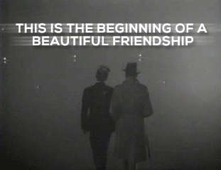


### Background

Here's [a pretty thorough reading on while loops](https://www.javascripttutorial.net/javascript-while-loop/).


### Setup

This is a typical challenge, in that you'll fork and clone this repo and work in a file called `main.js`. But there are no tests and no app, as you'll see below!


### Workflow

This is NOT a test-driven assignment, but we WILL be writing everything in functions. Then we will be calling each of those functions below their definition, so that when we run `node main.js` and execute the code, we can see what gets printed. Let's solve an imaginary first one together as an example!

When you're given the following instruction:

"Challenge 0: write a function that loops from 1 to 3, printing each number."

You would write the below code: 
```javascript
function challenge0() {
    let num = 1;
    while (num <= 3) {
        console.log(num);
        num= num + 1;
    }
}

challenge0();
```
(Ignore the line with the word "javascript" on it if you're reading the straight markdown; together with the  surrounding triple backticks, that adds syntax coloration in the web version. Feel free to check out the README on GitHub to see!)

Now when we call `node main.js` in our terminal, we'll see a 1 printed there, and then a 2, and then a 3.

And that's how you'll do each of these challenges!


### A Note On Challenge Difficulty

There are many challenges below, and they get very difficult. This is another assignment that is absolutely fantastic to return to if (when) you don't finish it. Do as many as you can! They each have variations on how to loop that will teach you something new.


### Some Hints

* Commenting out your previous function calls can help keep your terminal output readable and clean.
* Feel free to jump around if you get stumped for too long on one. And research isn't cheating!
* Pay careful attention to the parameters each function is being asked to take in, as well as each's example output.
* When you get to some of the harder string challenges, remember that we can place any number into the square brackets after a string, and we will get back the single character at that index. That means a number that gets progressively higher (say... a variable in a loop!) will mean you can hit a higher-indexed character each time its value goes up.
* You will have to combine your knowledge of if/else, parameters, and many more to fully complete this assignment.


1) Write a function that prints the numbers from 1 to 5. Note that, since we're hard-coding our starting point (1) and our end point (5), no parameters are required!

Example output:

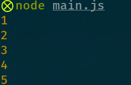

2) Write a function that prints the numbers from `1` to whatever number is passed in as a parameter. Call your function with `6` as the parameter, and you should see 1, 2, 3, 4, 5, and 6 printed. Now call it with `3`, and you should see 1, 2, and 3 printed. HINT: you can check the value of a counter variable against the parameter you're taking in.

Example output:

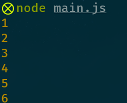

3) Write a function that takes in two parameters and prints the numbers from the first to the second, INCLUSIVE. Call it with `3` and `8` as parameters, and then again with `-2` and `1`.

Example output:

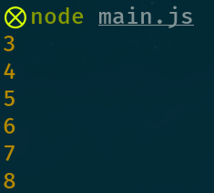

4) Write a function that prints the numbers from 1 to the number given, and then, after each number, print "Odd" if it's an odd number and "Even" if it's an even number. Print that pair of things (number and odd/even string) on one line or split them between two--up to you! Call it with the parameter 5. HINT: remember the modulus operation?

Example output:

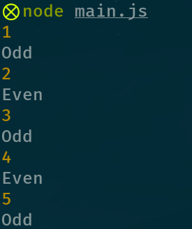

5) Print the even numbers ONLY from 1 to whatever number is passed in (inclusive). Call it with 10, and make sure you're getting 2, 4, 6, 8, and 10 printed out! HINT: you can use an `if` (or any other code!) within curly braces, whether it's a function or a loop.

Example output:

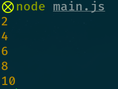

6) Write a function that prints the numbers from 10 to 1, in descending order. Now call it! HINT: we can change a counter variable in any way we decide. It does not have to be just upping it by 1!

Example output:

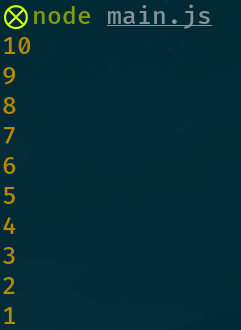

7) Write a function that prints the numbers from 10 to 1, in descending order, followed by "Blast off!".

Example output:

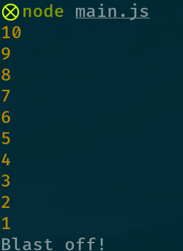

8) Write a function that prints the numbers from the parameter given down to 1, in descending order, counting by 3s. Then call it with 20. You should see 20, 17, 14, and so on, down to 2. It should not print 1 or anything below it.

Example output:

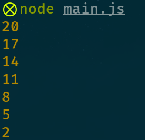


### String Challenges

9) Write a function that prints "Hello!" seven times, each time PRECEDED by the number we're on, a period, and a space. That is, if we're on number 5, we should print: "5. Hello!" Note that, since we're hard-coding everything, no parameters are required. Now call it and observe your console. Count 'em up and make sure there are 7 printings!

Example output:

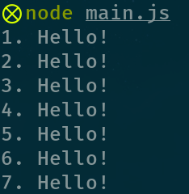

10). Write a function that prints in the same format as above, and also 7 times, but with a string passed in instead of a hard-coded "Hello!". Call it with the string of your choosing. You should see the same results as the previous challenge, but with the string you pass in instead of "Hello!".

Example output (your string may vary!):

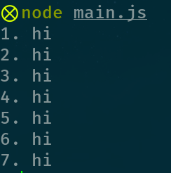

11). Write a function that takes in a string AND a number and prints that string that number of times. Now call it with the parameters of "Good-bye..." and `4`, and then "Get out!" and `6`.

Example output:

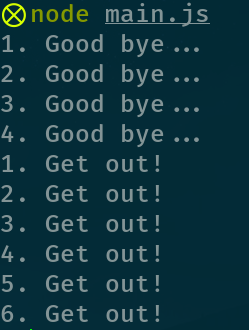

12). Write a function that takes in a string and prints every character individually of that string. Then call it with "think". HINT: remember, indices are just numbers! HINT 2: there's a property of any string that can tell you where to stop getting indices. But now these hints are getting a bit... lengthy.

Example output:

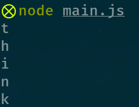

13). Write a function that prints every OTHER character of its string parameter individually. Call it with "Nobody", and make sure you're printing "o", followed by "o", followed by "y".

Example output:

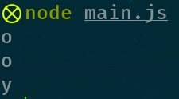

14). Write a function that prints a string's individual characters backwards. Use a loop for this, NOT `.join`. Call it with 'Mesuara'.

Example output:

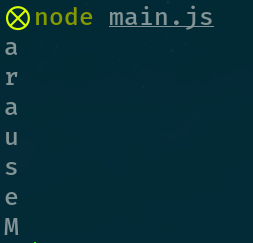


### Challenge Challenges

15). Actual for real FizzBuzz! Write a function that takes in a number and prints EACH integer from 1 to that number, inclusive. If the number is divisible by 3, print "Fizz" instead of the number. If it's divisible by 5, print "Buzz" instead of the number. If it's divisible by both, print "FizzBuzz". Now call it with 15 and check the output.

Example output:

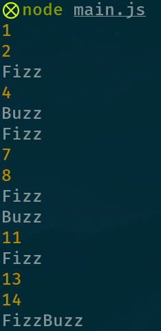

16). [Fibonacci!](https://en.wikipedia.org/wiki/Fibonacci_number) Write a function that takes in a number and prints each Fibonacci number (starting with 0 and 1) from 1 to that number, inclusive. Call it with 21, and you should see the Fibonacci sequence up to and including 21 (1, 1, 2, 3, 5, 8, 13, 21).

Example output:

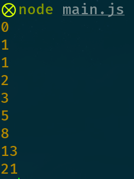
